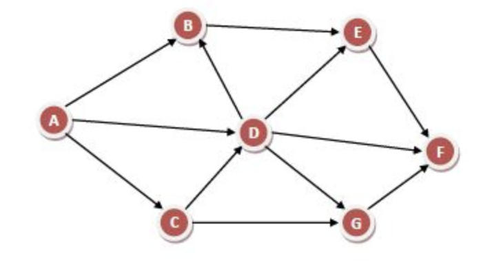
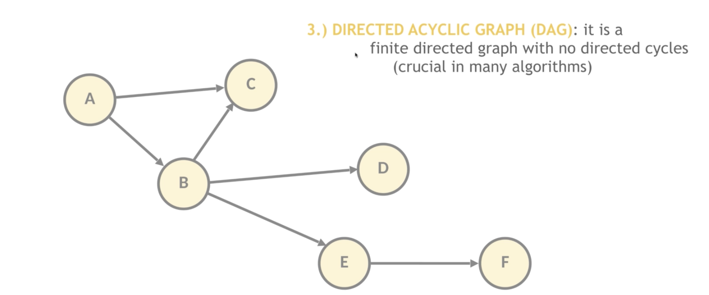

# Task 1 & 2

To compile project and run test with maven `mvn clean test`.

## Assumptions
From requirements:
- graphs are acyclic
- node.getChildren() is not null and has no null entries

Further assumptions:
- graph is directed (children have no link to parent, only vice-versa)
- from starting node there exists path to every node in the graph (no disconnected parts of graph)

Therefore, the most general data structure that fits into these assumptions is Directed Acyclic Graph.

## Solution
`org.cisco.interview.GraphUtils.java` contains both methods `List<GNode> walkGraph(GNode node)` and `List<List<GNode>> paths(GNode node)`.

`List<GNode> walkGraph(GNode node)` uses Depth-First-Search over Breadth-First-Search because:
- it is easier to understand and implement (follows directions of a graph)
- have the same linear time complexity as BFS and in most cases better memory complexity (even though in the worst case it's linear as well)
- in Direct Acyclic Graphs DFS has no disadvantage compared to BFS (cannot run into cycle issues)

`List<List<GNode>> paths(GNode node)` uses Depth-First-Search like algorithm for searching possible paths with following logic:
- if current node is leaf, we have just found a path and save it
- if node is not leaf, add node to current path and recursively calls method for all children
- on the way back up the graph (when all children of current node were recursively processed) it's important not forget to remove current node from current path

## Tests
Tests are located in `org.cisco.interview.GraphUtilsTest.java` and are working with following data structures:
- single node
- linear graph
- binary tree
- tree
- Directed Acyclic Graph 1

  

- Directed Acyclic Graph 2

  